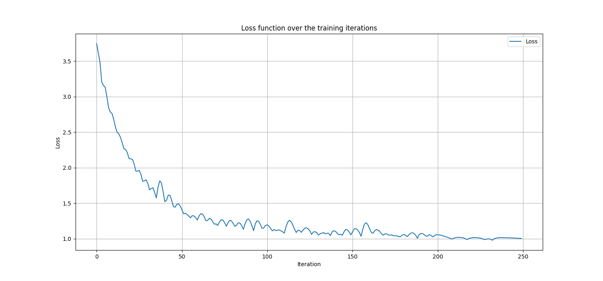
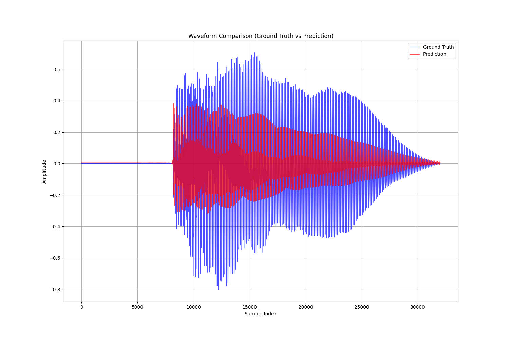
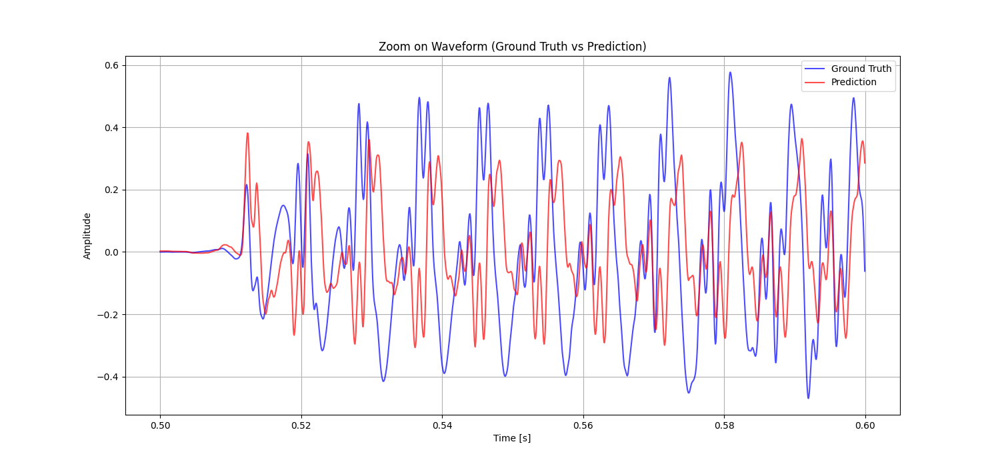
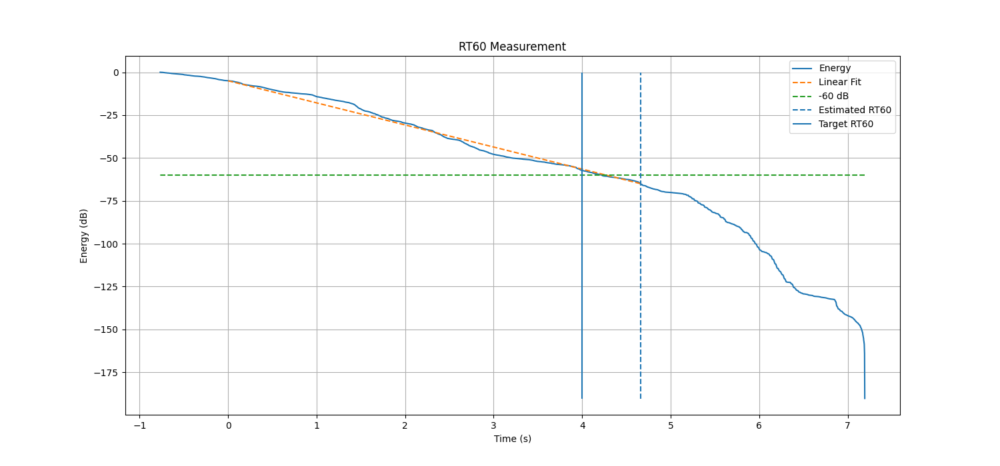

# Report
Setting un a repository with the code and the results of the experiments for the baseline model.
The structure of the model and the training-without validation are taken from: (https://github.com/csteinmetz1/steerable-nafx)

```python train.py --save tcn_test_250.pth --iters 250```

## Training...

```
Shape of x torch.Size([1, 1, 576000]) - Shape of y torch.Size([1, 1, 576000]) - Shape of c: torch.Size([1, 1, 2])
Parameters: 22.086 k
Receptive field: 55556 samples or 3472.2 ms
Learning rate schedule: 1:1.00e-03 -> 200:1.00e-04 -> 237:1.00e-05
----------------------------------------------------------------
        Layer (type)               Output Shape         Param #
================================================================
            Conv1d-1            [-1, 32, 65531]             224
             PReLU-2            [-1, 32, 65531]               1
            Conv1d-3            [-1, 32, 65536]              32
          TCNBlock-4            [-1, 32, 65531]               0
            Conv1d-5            [-1, 32, 65481]           6,176
             PReLU-6            [-1, 32, 65481]               1
            Conv1d-7            [-1, 32, 65531]           1,024
          TCNBlock-8            [-1, 32, 65481]               0
            Conv1d-9            [-1, 32, 64981]           6,176
            PReLU-10            [-1, 32, 64981]               1
           Conv1d-11            [-1, 32, 65481]           1,024
         TCNBlock-12            [-1, 32, 64981]               0
           Conv1d-13            [-1, 32, 59981]           6,176
            PReLU-14            [-1, 32, 59981]               1
           Conv1d-15            [-1, 32, 64981]           1,024
         TCNBlock-16            [-1, 32, 59981]               0
           Conv1d-17              [-1, 1, 9981]             193
            PReLU-18              [-1, 1, 9981]               1
           Conv1d-19             [-1, 1, 59981]              32
         TCNBlock-20              [-1, 1, 9981]               0
================================================================
Total params: 22,086
Trainable params: 22,086
Non-trainable params: 0
----------------------------------------------------------------
Input size (MB): 0.50
Forward/backward pass size (MB): 252.02
Params size (MB): 0.08
Estimated Total Size (MB): 252.60
----------------------------------------------------------------
 Loss at iteration 1: 3.748e+00 | 
...
 Loss at iteration 250: 1.003e+00 | 
```



 ## Evaluation...

```python eval.py --load tcn_test_50.pth```

```
Average L1 loss: 0.09210855513811111
Average STFT loss: 1.705861210823059
Average LUFS difference: 4.642814513876783
Average Aggregate Loss: 1.7979698181152344
```







## RT60
```python -m utils.transfer_function --load tcn_test_50.pth --input inverse_filter.wav```



## Transfer Function


